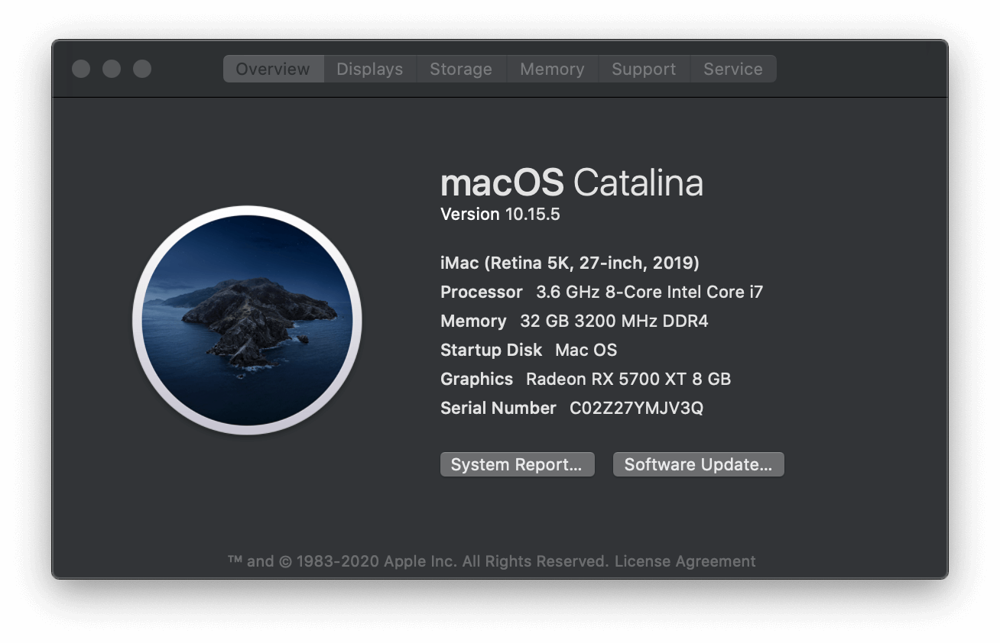
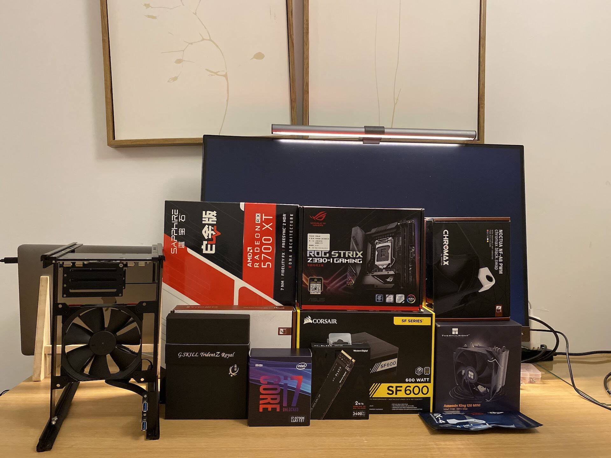
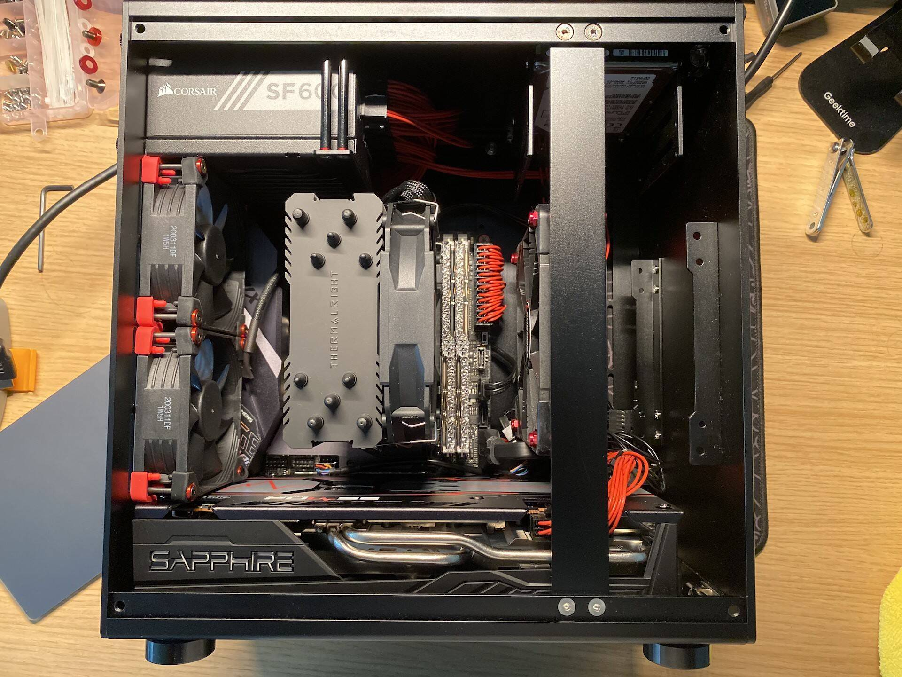
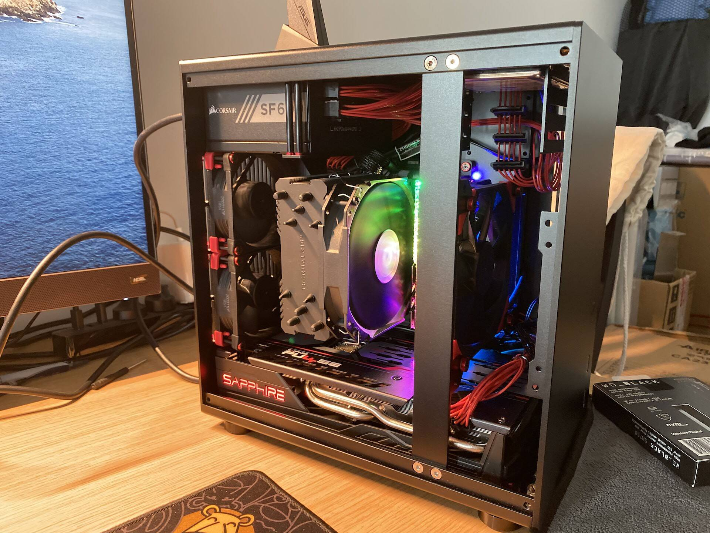

# Asus z390-itx * i7 9700k * Sapphire RX 5700XT  hackintosh opencore-0.5.9 macOS Catalina-10.15.5 2020.06.18
## 硬件配置

20200520-20200610 购入

|        | 型号                           | 价格         |
| ------ | ------------------------------ | ------------ |
| 电源   | 海盗船 SF600 SFX               | 729 tb       |
| 主板   | ASUS ROG STRIX Z390-I          | 1659 tb      |
| CPU    | i7 9700K                       | 2300         |
| 内存   | G.Skill Royale 32GB (2 x 16GB) | 1299 jd      |
| 显卡   | Sapphire RX 5700XT 8G D6       | 2699 jd      |
| 硬盘   | sn 750 2t                      | 2150 tm      |
| 散热器 | ak120 mini                     | 197.35  tb   |
| 网卡   | DW1560                         | 288  tb      |
| 风扇   | Noctua NF-F12 PWM x 2          | 147.79x2 tb  |
| 风扇   | 猫头鹰 NF-A8 PWM x2            | 113.54x2  tb |
| 其他   | 镀银线                         | 109 闲鱼     |
| 其他   | 银欣风扇防尘滤网 x2            | 40  tb       |

## 图片预览

## 黑苹果配齐计划

硬件的选配的成功黑苹果几乎就成功了90%，所以这是很重要的一环。

1. 选购一个心仪的机箱

   - ITX
   - M-ATX
   - ATX

2. 根据机箱以及购买指南选择主板等配件

   - 机箱能装下的电源&散热器
   - CPU带K和不带K(是否支持随航 sidecar)
   - 显卡能否免驱
   - SSD固态硬盘是否支持, PM981A无法安装？三星970 evo plus需要升级固件版本
   - 网卡的支持(wifi + 蓝牙 + AirDrop) 

3. 全网搜索你的主板CPU显卡 根据别人家黑苹果的成功案例，重新调整硬件选择

4. 制作macOS U盘安装盘

5. OpenCore配置 

   - 工具准备
     - Xcode
     - [GibMacOS](https://github.com/corpnewt/gibMacOS)
     - [MountEFI](https://github.com/corpnewt/MountEFI)
     - [OpenCorePkg](https://github.com/acidanthera/OpenCorePkg/releases)
     - [ProperTree](https://github.com/corpnewt/ProperTree)
     - [GenSMBIOS](https://github.com/corpnewt/GenSMBIOS)
     - config.plist 校验 https://opencore.slowgeek.com/

   - 补全文件 (内核&驱动&补丁)
     - ACPI文件夹里aml后缀文件的来源？
     - Driver文件夹里的efi后缀文件来源？
     - Kexts文件夹里kext后缀的文件来源？
     - 网卡(DW1560 BCM94352Z) wifi&蓝牙的驱动哪里找？  关键字 dw 1560 BCM94352Z opencore

6. config.plist配置

7. 主板BIOS配置

8. 从U盘启动 OpenCore 安装 macOS

9. 后续驱动&补丁完善

## 安装步骤

安装配置参考文档：https://dortania.github.io/OpenCore-Desktop-Guide/

## Reference

#### 硬件

- [MK3S](https://www.chiphell.com/thread-2198357-1-1.html)
- [MK3S装机Show Black MacOs](https://www.chiphell.com/thread-1920224-1-1.html)
- [TU150+5700XT+9700K黑苹果](https://www.chiphell.com/thread-2164085-1-1.html)
- [ITX Hackintosh / PC 购买、组装、安装系统心得](https://ladit.me/posts/my-itx-hackintosh-and-pc-buying-build-installation-experience/)
- [NZXT H1 & Hackintosh](https://www.chiphell.com/thread-2208414-1-1.html)
- [The everything works Asus Z390-I Gaming * i7-8700K * SAPPHIRE NITRO+ Radeon RX Vega 64 Build](https://www.tonymacx86.com/threads/the-everything-works-asus-z390-i-gaming-i7-8700k-sapphire-nitro-radeon-rx-vega-64-build.272572/)
- [OC 0.5.9, macOS 10.15.5, Asus Z390-I, Intel i7-9700K, Corsair AIO H100i, Sapphire RX 580, Corsair 32GB DRAM, Fenvi BCM94360NG, NZXT H210](https://www.reddit.com/r/hackintosh/comments/gvgiam/modified_bw_miniitx_build_wguide_config_oc_059/)
- [Z390 Phantom Gaming ITX w/ i7 9700k + RX 5700 XT in Ncase M1 V6.1](https://www.reddit.com/r/hackintosh/comments/g75bk3/opencore_catalina_10154_windows_10_on_z390/)

### 网卡

- [Using BCM84352Z, with OpenCore and Catalina](https://www.reddit.com/r/hackintosh/comments/ew76me/using_bcm84352z_with_opencore_and_catalina/)
- [Network and Audio setup with OpenCore](https://aplus.rs/2020/opencore-network-audio/)

